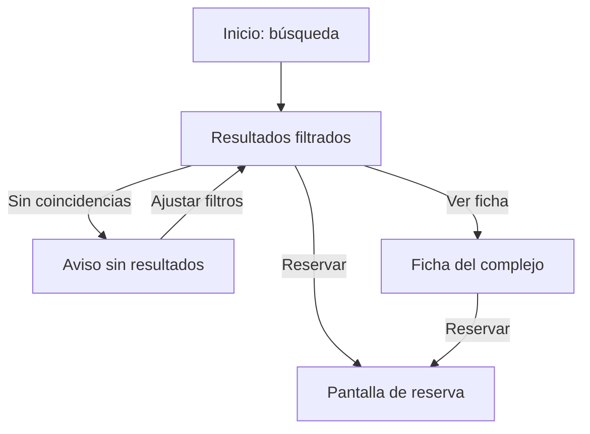

# AE2 — Opción 3: búsqueda y filtro del catálogo de CanchaYa
# ALUMNO: Da Silva VIana Juan MArtin

## Módulo elegido

La pantalla de inicio permite explorar los complejos de fútbol de Posadas. El visitante puede buscar por nombre o dirección y combinar zona, tipo de cancha y servicios. Los resultados se actualizan sin recargar la página.

## Cumplimiento del reto JavaScript

| Requisito | Implementación |
| --- | --- |
| Eventos desacoplados | `app.js` registra `addEventListener("input", ...)` para el texto, `addEventListener("change", ...)` para la zona y `addEventListener("click", ...)` para los botones de tipo y servicios. El envío del formulario también se intercepta con `addEventListener("submit", ...)` y `preventDefault()`. El HTML no contiene `onclick` ni `onsubmit`. |
| HTTP y asincronía | `app.js` hace `await fetch("data/complejos.json")`, comprueba `respuesta.ok` y procesa `await respuesta.json()`. Si falla, muestra un aviso visible. |
| Filtrado en memoria | Tras la carga inicial, `catalogo.filter(...)` evalúa texto, zona, tipo y servicios. Cambiar filtros no requiere otra petición. |
| DOM dinámico | `actualizar()` reconstruye `#complejos-lista`, actualiza `#results-count` y comunica resultados o ausencia de coincidencias. |

`main.js` sigue atendiendo el menú, los listados, la ficha y el formulario de reserva. Esas pantallas también cargan `data/complejos.json`, de modo que los datos de los seis complejos se mantienen en un único archivo. El JSON es un recurso local estático: este AE2 **no implementa un backend, una base de datos, disponibilidad real ni confirmación persistente de reservas**.

## Fundamentación de SOHDM

Para este módulo se toma un **escenario de exploración y búsqueda**: la persona necesita encontrar un complejo que cumpla sus criterios y avanzar a la información o reserva. El escenario describe acciones y alternativas del usuario; el mapa navegacional indica a qué pantallas puede ir.

**Actor:** visitante que busca una cancha.  
**Objetivo:** encontrar un complejo por nombre, zona, tipo y servicios.  
**Precondición:** se cargó el catálogo local.

1. El visitante entra al inicio. El sitio solicita el catálogo JSON y presenta los complejos.
2. Escribe un nombre o dirección, cambia la zona y/o elige tipo y servicios.
3. El sistema filtra los objetos `Complejo` en memoria y actualiza la lista visible y el contador.
4. El visitante abre la ficha o continúa a la pantalla de reserva del complejo elegido.
5. **Alternativa sin coincidencias:** se muestra un mensaje y puede cambiar los criterios sin recargar.
6. **Alternativa de error HTTP:** se muestra un aviso y no se presentan resultados inventados.

**Mapa navegacional del escenario de búsqueda:**

El filtrado y el aviso ocurren en la pantalla de inicio, sin navegación ni recarga. Los criterios de búsqueda son controles de la vista; los registros de `data/complejos.json` representan los complejos del dominio. `detalle.html?c=id` y `comprar.html?c=id` son los destinos navegacionales para el complejo elegido.

Esta aplicación del enfoque por escenarios explica cómo las acciones de búsqueda guían la navegación. No constituye por sí sola el desarrollo completo de todas las etapas de SOHDM.

## Ejecución y comprobación

1. Abrir el proyecto desde Apache de XAMPP, por ejemplo `http://localhost/proyecto_paradigmas_3/`. Abrir `index.html` como `file://` puede impedir la solicitud `fetch`.
2. En la pestaña **Red/Network** del navegador, comprobar que se solicita `data/complejos.json` con respuesta HTTP 200.
3. Escribir `Terraza`: debe quedar un complejo. Borrar el texto: vuelven los seis.
4. Elegir **Fútbol 11**: debe quedar **El Potrero**. Elegir **Centro** con Fútbol 11: aparece el mensaje de cero resultados.
5. Volver a Fútbol 5 y marcar **Quincho**: se reducen los resultados. Abrir una ficha o ir a reservar y verificar que se muestran los datos del mismo JSON.
